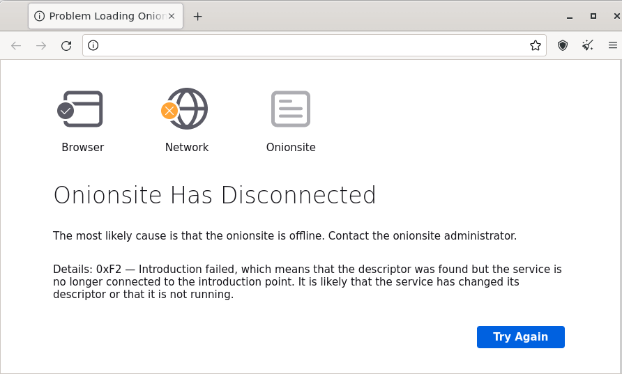

# Check Tor Connection

[](https://github.com/ayanamitech/check-tor-connection/actions)
[](https://npmjs.org/package/check-tor-connection)
[](https://npmjs.org/package/check-tor-connection)
[](https://snyk.io/test/github/ayanamitech/check-tor-connection)
[](https://github.com/ayanamitech/check-tor-connection)
[](https://github.com/ayanamitech/check-tor-connection)
[](https://opensource.org/licenses/MIT)

Auto check Tor connection for Ubuntu using Node.js

### Why?



You probably don't want to see something like this for your onion site.

This happens very often for tor sites hosted behind a proxy, vpn, or any servers with unstable internet connection.

So, we are using Node.js to manage your local tor service restart when the connection with other peers is unstable.

### Install & Start

```bash
$ npm i -g check-tor-connection
$ check-tor
```

### Configuration

```json
{
  "RETRY_TEST": 10,
  "RETRY_INTERVAL": 60,
  "RESTART_CMD": "sudo systemctl restart tor",
  "HEALTH_CHECK": "https://check.torproject.org/api/ip",
  "HEALTH_CHECK_ONION": "",
  "HEALTH_CHECK_INTERVAL": 1800,
  "USER_AGENT": "Mozilla/5.0 (Windows NT 10.0; rv:91.0) Gecko/20100101 Firefox/91.0",
  "USE_ONION": false,
  "TOR_HOST": "127.0.0.1",
  "TOR_PORT": 9050
}
```

+ `RETRY_TEST`: Max retry for health check

+ `RETRY_INTERVAL`: Interval for retry in seconds

+ `RESTART_CMD`: Command to restart local tor service

+ `HEALTH_CHECK`: URL to perform a health check, note that this **should not** be an URL for servers behind the firewall that often blocks tor connections (like Cloudflare or CloudFront). Receiving HTTP Error codes will result in a test failure.

+ `HEALTH_CHECK_ONION`: Onion address to perform health check, requires `USE_ONION` to be `true` as well.

+ `HEALTH_CHECK_INTERVAL`: For how often should we perform the health check in seconds, the recommended value is 1800 seconds which would be half of an hour.

+ `USER_AGENT`: Will send GET request to server with this `USER_AGENT` header value, to protect your privacy

+ `USE_ONION`: Should be true to connect with onion address instead of clearnet address

+ `TOR_HOST`: Interface for Tor Service (Or tor browser)

+ `TOR_PORT`: Port for Tor Service (Or tor browser) (Default to 9050 for Tor Service, 9150 for Tor Browser)

Note that you could either define these config parameters via `config.json` or as an environment variable with `export` command which is useful to setup a docker container.
